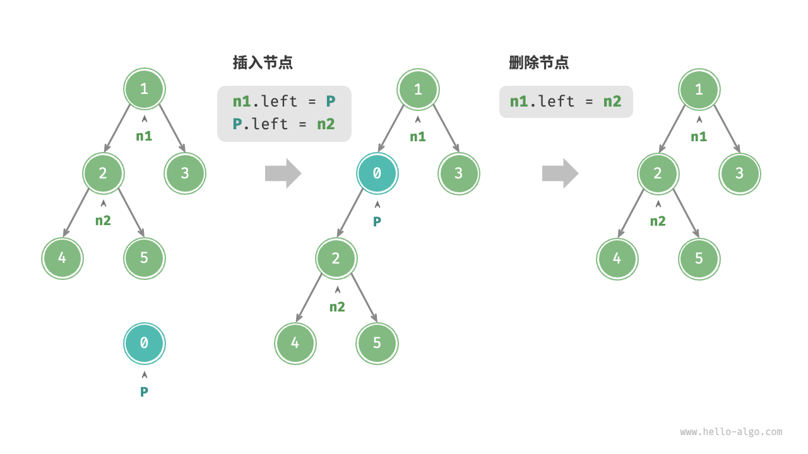

# 二叉树基本操作

---

## 康奈尔笔记法整理

### 📝 提示区域 (Questions & Keywords) | 📚 笔记内容 (Notes)

#### **基础概念篇**

| 提示问题 | 详细笔记 |
|---------|---------|
| **什么是二叉树节点结构？** | ```c<br/>typedef struct TreeNode {<br/>    int val;<br/>    int height;<br/>    struct TreeNode* left;   // 注意：结构体内自引用必须用struct<br/>    struct TreeNode* right;<br/>} TreeNode;<br/>``` |
| **为什么结构体内要用`struct TreeNode*`？** | • 在C语言中，结构体内部引用自己时，typedef还未完成<br/>• 此时`TreeNode`名称还不可用<br/>• 必须使用`struct TreeNode`完整形式 |
| **如何安全创建节点？** | ```c<br/>TreeNode* newTreeNode(int val) {<br/>    TreeNode *node = malloc(sizeof(TreeNode));<br/>    if(node == NULL) {  // 关键：检查malloc失败<br/>        printf("内存分配失败\n");<br/>        return NULL;<br/>    }<br/>    node->val = val;<br/>    node->height = 0;<br/>    node->left = node->right = NULL;<br/>    return node;<br/>}<br/>``` |

#### **内存管理篇**

| 提示问题 | 详细笔记 |
|---------|---------|
| **为什么二叉树释放必须用后序遍历？** | • `free(root)`后，`root->left`和`root->right`变为野指针<br/>• 访问已释放内存导致未定义行为<br/>• **正确顺序**：左子树 → 右子树 → 根节点 |
| **如何正确释放二叉树？** | ```c<br/>void freeTreeNode(TreeNode* root) {<br/>    if(root == NULL) return;<br/>    freeTreeNode(root->left);   // 先释放左子树<br/>    freeTreeNode(root->right);  // 再释放右子树<br/>    free(root);                 // 最后释放根节点<br/>}<br/>``` |
| **内存泄漏如何避免？** | • 每个`malloc`都要有对应的`free`<br/>• main函数结束前调用`freeTreeNode(root)`<br/>• 使用valgrind等工具检测内存泄漏 |

#### **数组与指针篇**

| 提示问题 | 详细笔记 |
|---------|---------|
| **`sizeof`在数组中的陷阱？** | ```c<br/>// 正确：局部数组<br/>int nums[] = {1,2,3,4,5};<br/>int size = sizeof(nums)/sizeof(int);  // 20/4 = 5<br/><br/>// 陷阱：函数参数中的数组退化为指针<br/>void func(int arr[]) {<br/>    int size = sizeof(arr)/sizeof(int);  // 8/4 = 2 (错误！)<br/>}<br/>``` |
| **为什么函数参数数组会退化？** | • `func(int arr[])` 等价于 `func(int* arr)`<br/>• 64位系统中指针大小为8字节<br/>• `sizeof(arr)`返回指针大小，不是数组大小 |
| **`arr[(*size)++]`执行顺序？** | 1. 先取`*size`当前值作为数组索引<br/>2. 使用该索引访问数组<br/>3. 然后将`*size`的值加1<br/>4. **关键**：先使用后自增 |

#### **遍历算法篇**

| 提示问题 | 详细笔记 |
|---------|---------|
| **四种遍历的访问顺序？** | • **前序**：根 → 左 → 右 (先处理当前节点)<br/>• **中序**：左 → 根 → 右 (中间处理当前节点)<br/>• **后序**：左 → 右 → 根 (最后处理当前节点)<br/>• **层序**：逐层从左到右 (广度优先遍历) |
| **前序遍历实现？** | ```c<br/>void preOrder(TreeNode* root, int* size) {<br/>    if(root == NULL) return;<br/>    arr[(*size)++] = root->val;  // 根<br/>    preOrder(root->left, size);   // 左<br/>    preOrder(root->right, size);  // 右<br/>}<br/>``` |
| **中序遍历实现？** | ```c<br/>void inOrder(TreeNode* root, int* size) {<br/>    if(root == NULL) return;<br/>    inOrder(root->left, size);    // 左<br/>    arr[(*size)++] = root->val;   // 根<br/>    inOrder(root->right, size);   // 右<br/>}<br/>``` |
| **后序遍历实现？** | ```c<br/>void postOrder(TreeNode* root, int* size) {<br/>    if(root == NULL) return;<br/>    postOrder(root->left, size);  // 左<br/>    postOrder(root->right, size); // 右<br/>    arr[(*size)++] = root->val;   // 根<br/>}<br/>``` |
| **层序遍历(BFS)实现？** | ```c<br/>int* levelOrder(TreeNode* root, int* size) {<br/>    TreeNode** queue = malloc(sizeof(TreeNode*) * MAX_SIZE);<br/>    int front = 0, rear = 0;<br/>    queue[rear++] = root;  // 根节点入队<br/>    int* arr = malloc(sizeof(int) * MAX_SIZE);<br/>    int index = 0;<br/>    while(front < rear) {  // 队列非空<br/>        TreeNode* node = queue[front++];  // 出队<br/>        arr[index++] = node->val;<br/>        if(node->left) queue[rear++] = node->left;<br/>        if(node->right) queue[rear++] = node->right;<br/>    }<br/>    *size = index;<br/>    free(queue);<br/>    return arr;<br/>}<br/>``` |
| **BFS vs DFS的区别？** | • **BFS(层序)**：使用队列，逐层遍历，适合最短路径<br/>• **DFS(深度优先)**：使用递归/栈，深度优先，适合路径搜索<br/>• **空间复杂度**：BFS O(w)宽度，DFS O(h)高度 |
| **如何避免数组越界？** | ```c<br/>if(*size >= MAX_SIZE) {<br/>    printf("数组空间不足！\n");<br/>    return;<br/>}<br/>``` |

#### **BFS核心概念篇**

| 提示问题 | 详细笔记 |
|---------|---------|
| **BFS队列的二级指针如何理解？** | ```c<br/>TreeNode** queue = malloc(sizeof(TreeNode*) * MAX_SIZE);<br/>// 内存布局：queue -> [ptr1][ptr2][ptr3]...<br/>//                    ↓     ↓     ↓<br/>//                  node1  node2  node3<br/>// 本质：指向指针数组的指针，类似哈希表的buckets<br/>``` |
| **队列空判断`front < rear`如何理解？** | • **front**：指向队头元素位置<br/>• **rear**：指向队尾下一个空位置<br/>• **front == rear**：队列为空<br/>• **front < rear**：队列有 (rear-front) 个元素<br/>• **入队**：queue[rear++] = node<br/>• **出队**：node = queue[front++] |
| **为什么需要index递增返回数组大小？** | • 调用者无法知道返回数组的确切大小<br/>• C语言数组不携带长度信息<br/>• 通过指针参数 `*size = index` 返回实际元素个数<br/>• 避免访问未初始化的数组元素 |
| **realloc的作用和注意事项？** | ```c<br/>// 作用：重新分配内存大小，节省空间<br/>arr = realloc(arr, sizeof(int) * actual_size);<br/>// 注意事项：<br/>// 1. 必须检查返回值是否为NULL<br/>// 2. 可能改变内存地址<br/>// 3. 失败时原内存块保持不变<br/>// 4. realloc(NULL, size) 等价于 malloc(size)<br/>``` |

#### **编程实践篇**

| 提示问题 | 详细笔记 |
|---------|---------|
| **头文件如何组织？** | • `.h`文件：结构体定义 + 函数声明<br/>• `.c`文件：函数实现<br/>• 避免在头文件中写函数实现 |
| **调试技巧？** | • 添加打印函数验证遍历结果<br/>• 使用递归深度参数跟踪调用栈<br/>• 内存检查工具检测泄漏 |
| **常见错误？** | • 忘记检查malloc返回值<br/>• 访问NULL指针<br/>• 忘记释放内存<br/>• 数组越界访问 |

---

## 📋 总结区域 (Summary)

**核心要点：**
1. **内存安全**：malloc检查 + 后序释放 + 避免野指针 + realloc优化
2. **语法细节**：结构体自引用语法 + sizeof陷阱 + 指针运算 + 二级指针
3. **算法理解**：四种遍历本质 + 递归vs队列 + DFS vs BFS + 边界处理
4. **数据结构**：队列实现BFS + front/rear指针 + FIFO特性
5. **实践技能**：模块化设计 + 调试方法 + 内存管理 + 动态数组返回

**记忆口诀：**
- "先malloc后free，先分配后释放"
- "后序遍历释放树，先子后父保安全"  
- "数组退化成指针，sizeof陷阱要小心"
- "前中后序看位置，递归终止是关键"
- "BFS用队列FIFO，DFS用递归栈LIFO"
- "front小于rear非空，二级指针存节点"

---

## 初始化

```c
// 基本结构
typedef struct TreeNode {
    int val;
    int height;
    struct TreeNode* left;   // 注意：必须用struct TreeNode
    struct TreeNode* right;
} TreeNode;

// 构造函数
TreeNode* newTreeNode(int val) {
    TreeNode *node = malloc(sizeof(TreeNode));
    if(node == NULL) {
        printf("内存分配失败\n");
        return NULL;
    }
    node->val = val;
    node->height = 0;
    node->left = node->right = NULL;
    return node;
}

// 析构函数 - 必须后序遍历
void freeTreeNode(TreeNode* root) {
    if(root == NULL) return;
    freeTreeNode(root->left);   // 先释放左子树
    freeTreeNode(root->right);  // 再释放右子树
    free(root);                 // 最后释放根节点
}
```

## 插入删除



**插入操作：**
- 创建新节点
- 调整父节点指针
- 维护树的性质

**删除操作：**
- 找到目标节点
- 处理子节点连接
- 释放节点内存

```c
// 插入示例
TreeNode* insertNode(TreeNode* root, int val) {
    if(root == NULL) {
        return newTreeNode(val);
    }
    
    if(val < root->val) {
        root->left = insertNode(root->left, val);
    } else {
        root->right = insertNode(root->right, val);
    }
    
    return root;
}
```

## 二叉树遍历

### 四种遍历方式
1. **前序遍历**：根 → 左 → 右 (用于复制树)
2. **中序遍历**：左 → 根 → 右 (二叉搜索树得到有序序列)  
3. **后序遍历**：左 → 右 → 根 (用于释放内存)
4. **层序遍历**：逐层从左到右 (用于打印树结构，最短路径)

### 完整实现

```c
#define MAX_SIZE 100
int arr[MAX_SIZE];

// 前序遍历
void preOrder(TreeNode* root, int* size) {
    if(root == NULL) return;
    if(*size >= MAX_SIZE) {
        printf("数组空间不足！\n");
        return;
    }
    arr[(*size)++] = root->val;  // 先访问根
    preOrder(root->left, size);   // 再访问左子树
    preOrder(root->right, size);  // 最后访问右子树
}

// 中序遍历
void inOrder(TreeNode* root, int* size) {
    if(root == NULL) return;
    if(*size >= MAX_SIZE) return;
    inOrder(root->left, size);    // 先访问左子树
    arr[(*size)++] = root->val;   // 再访问根
    inOrder(root->right, size);   // 最后访问右子树
}

// 后序遍历
void postOrder(TreeNode* root, int* size) {
    if(root == NULL) return;
    if(*size >= MAX_SIZE) return;
    postOrder(root->left, size);  // 先访问左子树
    postOrder(root->right, size); // 再访问右子树
    arr[(*size)++] = root->val;   // 最后访问根
}

// 层序遍历 (BFS) - 返回动态分配的数组
int* levelOrder(TreeNode* root, int* size) {
    if(root == NULL) {
        *size = 0;
        return NULL;
    }
    
    // 创建队列 - 二级指针存储节点指针
    TreeNode** queue = (TreeNode**)malloc(sizeof(TreeNode*) * MAX_SIZE);
    if(queue == NULL) {
        *size = 0;
        return NULL;
    }
    
    int front = 0, rear = 0;
    queue[rear++] = root;  // 根节点入队
    
    // 创建结果数组
    int* arr = (int*)malloc(sizeof(int) * MAX_SIZE);
    if(arr == NULL) {
        free(queue);
        *size = 0;
        return NULL;
    }
    
    int index = 0;
    
    // BFS遍历：队列非空时继续
    while(front < rear) {
        TreeNode* node = queue[front++];  // 出队
        arr[index++] = node->val;         // 记录节点值
        
        // 子节点入队
        if(node->left != NULL) {
            queue[rear++] = node->left;
        }
        if(node->right != NULL) {
            queue[rear++] = node->right;
        }
    }
    
    // 返回实际大小和优化内存
    *size = index;
    
    // 可选：内存优化 - 缩小到实际大小
    if(index > 0 && index < MAX_SIZE / 2) {
        int* temp = realloc(arr, sizeof(int) * index);
        if(temp != NULL) {
            arr = temp;
        }
    }
    
    free(queue);
    return arr;
}
```

### 测试代码

```c
int main(void) {
    // 创建测试树
    //       1
    //      / \
    //     2   3
    //    / \
    //   4   5
    TreeNode *root = newTreeNode(1);
    TreeNode *n2 = newTreeNode(2);
    TreeNode *n3 = newTreeNode(3);
    TreeNode *n4 = newTreeNode(4);
    TreeNode *n5 = newTreeNode(5);
    
    root->left = n2;
    root->right = n3;
    n2->left = n4;
    n2->right = n5;
    
    printf("二叉树结构:\n");
    printf("       1\n");
    printf("      / \\\n");
    printf("     2   3\n");
    printf("    / \\\n");
    printf("   4   5\n\n");
    
    int size = 0;
    
    // 前序遍历测试 (DFS)
    size = 0;
    preOrder(root, &size);
    printf("前序遍历 (根左右): ");
    for(int i = 0; i < size; i++) {
        printf("%d ", arr[i]);
    }
    printf("\n");  // 输出: 1 2 4 5 3
    
    // 中序遍历测试 (DFS)
    size = 0;
    inOrder(root, &size);
    printf("中序遍历 (左根右): ");
    for(int i = 0; i < size; i++) {
        printf("%d ", arr[i]);
    }
    printf("\n");  // 输出: 4 2 5 1 3
    
    // 后序遍历测试 (DFS)
    size = 0;
    postOrder(root, &size);
    printf("后序遍历 (左右根): ");
    for(int i = 0; i < size; i++) {
        printf("%d ", arr[i]);
    }
    printf("\n");  // 输出: 4 5 2 3 1
    
    // 层序遍历测试 (BFS)
    size = 0;
    int* levelResult = levelOrder(root, &size);
    printf("层序遍历 (BFS): ");
    for(int i = 0; i < size; i++) {
        printf("%d ", levelResult[i]);
    }
    printf("\n");  // 输出: 1 2 3 4 5
    
    printf("\n遍历方式对比:\n");
    printf("DFS深度优先: 前序(1243), 中序(4251), 后序(4521)\n");
    printf("BFS广度优先: 层序(12345) - 逐层从左到右\n");
    
    // 释放内存
    free(levelResult);  // 释放层序遍历返回的动态数组
    freeTreeNode(root); // 释放整个树
    
    return 0;
}
```

## 📊 BFS vs DFS 对比总结

| 特性 | BFS (层序遍历) | DFS (前中后序遍历) |
|------|---------------|-------------------|
| **数据结构** | 队列 (Queue) | 递归栈 (Stack) |
| **访问顺序** | 逐层从左到右 | 深度优先 |
| **空间复杂度** | O(w) - 树的最大宽度 | O(h) - 树的最大高度 |
| **时间复杂度** | O(n) | O(n) |
| **实现方式** | while循环 + 队列 | 递归函数调用 |
| **内存分配** | 需要动态分配数组和队列 | 使用系统调用栈 |
| **适用场景** | 层次打印、最短路径、最小深度 | 深度搜索、树的复制、释放内存 |
| **核心概念** | front < rear (队列非空) | 递归终止条件 |
| **典型应用** | 二叉树的层序打印 | 文件系统遍历 |

### 🎯 选择建议：
- **需要逐层处理**：选择 BFS
- **需要深度搜索**：选择 DFS  
- **内存有限制且树很宽**：选择 DFS
- **内存有限制且树很深**：选择 BFS
- **需要最短路径**：选择 BFS
- **需要路径回溯**：选择 DFS