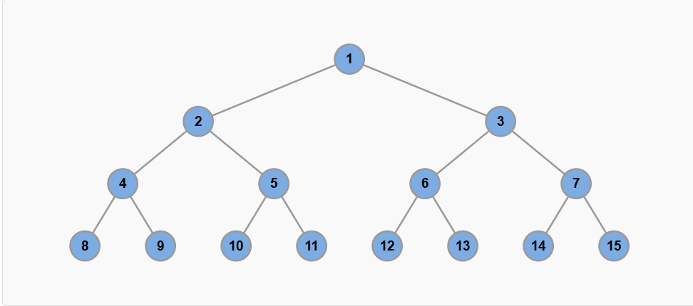

# 二叉树

本教程取自`https://labuladong.online/algo/data-structure-basic/binary-tree-basic/`


## 二叉树结构及遍历
--------------------------
### 二叉树基础及常见类型

#### 几种常见的二叉树

**术语**
子节点，父节点，子树，左\右子树，根节点，叶子节点，最大深度，最大高度

**1.满二叉树**

每一层节点都是满的，整棵树像一个正三角形。假设其深度是h，总结点数就为`2^h - 1`.



**2.完全二叉树**

完全二叉树是指，二叉树的每一层的节点都紧凑靠左排列，且除了最后一层，其他每层都必须是满的：

**重点**
完全二叉树的特点：由于它的节点紧凑排列，如果从左到右从上到下对它的每个节点编号，那么父子节点的索引存在明显的规律。

完全二叉树还有个比较难发觉的性质：完全二叉树的左右子树也是完全二叉树。

或者更准确地说应该是：完全二叉树的左右子树中，至少有一棵是满二叉树。


**二叉搜索树**

二叉搜索树（Binary Search Tree，简称 BST）是一种很常见的二叉树，它的定义是：

对于树中的每个节点，其左子树的每个节点的值都要小于这个节点的值，右子树的每个节点的值都要大于这个节点的值。你可以简单记为「左小右大」。

*区分*


节点 7 的左子树所有节点的值都小于 7，右子树所有节点的值都大于 7；节点 4 的左子树所有节点的值都小于 4，右子树所有节点的值都大于 4，以此类推。

相反的，下面这棵树就不是 BST：


**重要意义**
BST 是非常常用的数据结构。因为左小右大的特性，可以让我们在 BST 中快速找到某个节点，或者找到某个范围内的所有节点，这是 BST 的优势所在。

**ie**: 比方说，对于一棵普通的二叉树，其中的节点大小没有任何规律可言，那么你要找到某个值为 x 的节点，只能从根节点开始遍历整棵树。

而对于 BST，你可以先对比根节点和 x 的大小关系，如果 x 比根节点大，那么根节点的整棵左子树就可以直接排除了，直接从右子树开始找，这样就可以快速定位到值为 x 的那个节点。

**高度平衡二叉树**

高度平衡二叉树（Height-Balanced Binary Tree）是一种特殊的二叉树，它的「每个节点」的左右子树的高度差不超过 1。

要注意是每个节点，而不仅仅是根节点。

比如下面这棵二叉树，根节点 1 的左子树高度是 2，右子树高度是 3；节点 2 的左子树高度是 1，右子树高度是 0；节点 3 的左子树高度是 2，右子树高度是 1，以此类推，每个节点的左右子树高度差都不超过 1，所以这是一棵高度平衡的二叉树：


下面这棵树就不是高度平衡的二叉树，因为节点 2 的左子树高度是 2，右子树高度是 0，高度差超过 1，不符合条件：


假设高度平衡二叉树中共有 
`N` 个节点，那么高度平衡二叉树的高度是 `O(logN)`。这是非常重要的性质，本站后面的章节会讲解几种基于二叉树的数据结构，如果能保证树的高度为 
`O(log⁡N)`，那么这些数据结构的增删查改效率就会很高。
反之，如果树很不平衡，比如这种极端情况：


那么这棵树其实就等同于单链表，在树中进行增删查改的效率就会大幅降低。


**自平衡二叉树**

上面介绍了高度平衡二叉树，说到它的高度为 `O(logN)`，增删查改的效率高。

如果我们可以在增删二叉树节点时对树的结构进行一些调整，那么就可以让树的高度始终是平衡的，这就是自平衡二叉树（Self-Balanced Binary Tree）。

自平衡的二叉树有很多种实现方式，最经典的就是 
红黑树，一种自平衡的二叉搜索树。


#### 二叉树的实现方式

最常见的二叉树就是类似链表那样的链式存储结构，每个二叉树节点有指向左右子节点的指针，这种方式比较简单直观。

力扣/LeetCode 上给你输入的二叉树一般都是用这种方式构建的，二叉树节点类 TreeNode 一般长这样：

```cpp
class TreeNode {
public:
    int val;
    TreeNode* left;
    TreeNode* right;
    TreeNode(int x) : val(x), left(nullptr), right(nullptr) {}
};

// 你可以这样构建一棵二叉树：
TreeNode* root = new TreeNode(1);
root->left = new TreeNode(2);
root->right = new TreeNode(3);
root->left->left = new TreeNode(4);
root->right->left = new TreeNode(5);
root->right->right = new TreeNode(6);

// 构建出来的二叉树是这样的：
//     1
//    / \
//   2   3
//  /   / \
// 4   5   6


```


既然说上面是比较常见的实现方式，那言下之意就是还有其他实现方式，对吧？

是的，在 `二叉堆原理及实现` 和 
`并查集算法详解` 中，我们会根据具体的需求场景选择用数组来存储二叉树。

在 `可视化面板` 可视化递归函数时，其实是根据函数堆栈生成的递归树，这也可以算是一种二叉树的实现方式。

另外，在一般的算法题中，我们可能会把实际问题抽象成二叉树结构，但我们并不需要真的用 `TreeNode` 创建一棵二叉树出来，而是直接用类似`哈希表` 的结构来表示二叉树/多叉树。

比方说这棵二叉树：


我可以用一个哈希表，其中的键是父节点 id，值是子节点 id 的列表（每个节点的 id 是唯一的），那么一个键值对就是一个多叉树节点了，这棵多叉树就可以表示成这样：

```cpp

// 1 -> {2, 3}
// 2 -> {4}
// 3 -> {5, 6}

unordered_map<int, vector<int>> tree;
tree[1] = {2, 3};
tree[2] = {4};
tree[3] = {5, 6};

```
这样就可以模拟和操作二叉树/多叉树结构，后文讲到图论的时候你就会知道，它有一个新的名字叫做 `邻接表` 。


### DFS


### BFS
递归遍历是依赖函数堆栈递归遍历二叉树的，遍历顺序是从最左侧开始，一列一列地走到最右侧。
二叉树的层序遍历，顾名思义，就是一层一层地遍历二叉树。

**三种写法**

**写法1**
最简易

**写法2**
记录深度depth

**写法3**
添加`State`类来记录每一层节点自己的深度，这样每个节点可以根据自己的权重来判断自己的深度，和后边图论的算法相关


## 二叉树结构的种种变换